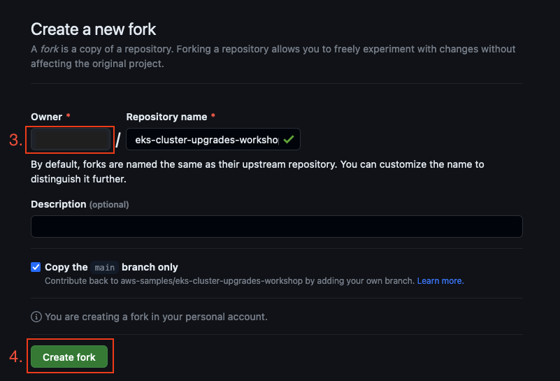

# Connect to GitHub:

Since we are using a GitOps approach we will need to install and connect `FluxV2` to a GitHub repository.

## GitHub Personal Access Token

:::info
If you don't have one token yet, check the [Creating a personal access token guide](https://docs.github.com/en/authentication/keeping-your-account-and-data-secure/creating-a-personal-access-token).
:::

:::caution
Remember to use the GitHub legacy tokens
:::

```bash
export GITHUB_TOKEN=<your-token>
export GITHUB_USER=<your-username>
```

```bash
echo "export GITHUB_TOKEN=${GITHUB_TOKEN}" | tee -a ~/.bash_profile
echo "export GITHUB_USER=${GITHUB_USER}" | tee -a ~/.bash_profile
```

## Create a fork of this [repo](https://github.com/aws-samples/eks-cluster-upgrades-workshop) in your GitHub account.




## Execute install.sh script

Now go back to your `Cloud9` IDE and execute the `install.sh` script present on `/home/ec2-user/environment` folder.

```bash
cd /home/ec2-user/environment && bash install.sh
```

Fill all the asked questions, and when it asks your for terraform state, make sure to point to the following path `/home/ec2-user/environment/terraform.tfstate`, see example below.

```bash
Enter the tf_state path (leave blank to generate infrastructure from scratch): /home/ec2-user/environment/terraform.tfstate
```

After this, the script will initialize and install `FluxV2` in your cluster pointing to your forked `GitHub` repository defined earlier, if everything succedeed you should see the following output.

```
Now proceed to flux module
```
