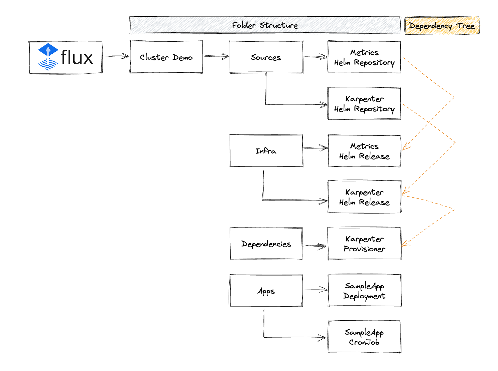

# Why GitOps?

One of the main customer challenges regarding EKS Cluster Upgrades is make sure that your applications and add-ons don’t break compatibility with the newer EKS version. To help on this goal we are going to use a GitOps strategy. GitOps works based on a SCM repository, where it becomes the only source of truth, and our GitOps controller, in this case FluxV2 will just mirror what we have declared into the repository.

## How a mono repo structure can benefit during EKS cluster upgrades?

As mentioned earlier, one of the main challenges that people face during cluster upgrades is compatibility, we need to validate our application’s manifests, making sure that we are not using anything removed from the API Server. So, using a mono repo strategy can help us on doing those validations easier. We can use tools such as kube-no-trouble and pluto to seek for those deprecated/removed apiVersions into a single place along with kubectl convertplugin that can help us on changing those apiVersions in an automated way. Also this repo structure help us on identifying our self-managed add-ons versions since all the add-ons that we are using are in a single place.



## Flux Reconciliation

Flux reconciliation is the process by which Flux continuously monitors a Git repository for changes to Kubernetes manifests and automatically applies them to a connected cluster. When a change is detected in the repository, Flux compares the updated manifest with the current state of the cluster. If there's a discrepancy, Flux updates the cluster to match the desired state defined in the Git repository. This GitOps-based approach ensures consistency, version control, and automation in managing Kubernetes deployments, streamlining CI/CD pipelines, and reducing human error.


## Enabling add-ons and understanding Flux reconciliation

In the previous module we have executed the `install.sh` script, it have installed flux into your cluster and also have cloned the forked repository. The script also has made some changes into some of our manifests, let's apply it and see how flux reconcile those changes.

```bash
cd /home/ec2-user/environment/eks-cluster-upgrades-workshop && git status
```


As you can see there are some unstaged files that we need to commit and push to our repo, those files are basically two add-ons that we are gonna be using during this workshop, `karpenter` and `argo-workflows`. Now let's uncomment lines `5` and `6` of add-ons `kustomization.yaml` (Kustomization object) file.

:::tip
In the context of Flux, a Kustomization object is a custom resource defined by the Kustomization CRD. Flux uses Kustomization resources to manage Kubernetes manifests, specifying the syncing interval, pruning resources, and validating manifests before applying them.
:::

```bash
sed -i "5s/^#//g" /home/ec2-user/environment/eks-cluster-upgrades-workshop/gitops/add-ons/kustomization.yaml
```