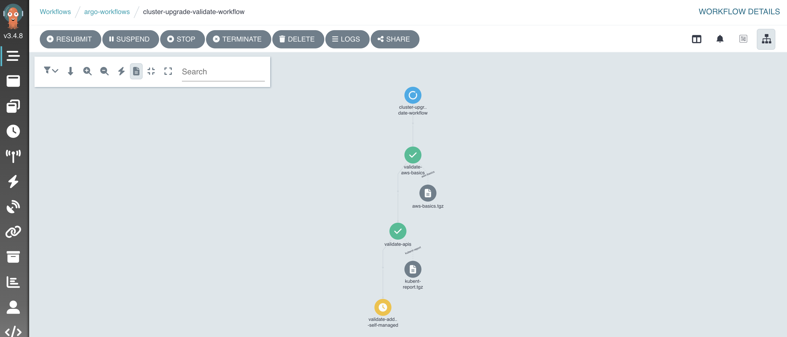
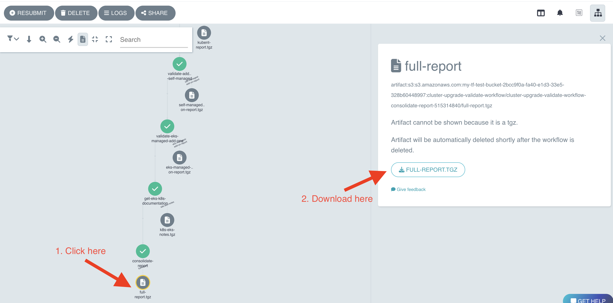

# Validating State

:::note
This is a suggested approach on how to implement a workflow to create an upgrade plan, take a look into the 
:::

Checking for deprecated APIs and updating your manifests to use the latest API versions before upgrading your Kubernetes cluster is crucial for preventing compatibility issues, avoiding downtime, maintaining a secure and stable environment, easing maintenance, staying informed about Kubernetes changes, and ensuring compliance with best practices. Using tools like Pluto, kube no trouble and kubectl convert streamlines the process of identifying and updating deprecated APIs, making it easier to maintain a healthy Kubernetes environment.


## Argo workflows validate pipeline

For this workshop we have automated all the validation steps in an `argo-workflows` pipeline, so let's run our workflow to verify what are the things that we need to change.

```bash
cd /home/ec2-user/environment/eks-cluster-upgrades-workshop/upgrades-workflows && kubectl apply -f upgrade-validate-workflow.yaml
```

Getting Argo workflows UI url:

```bash
echo $(kubectl get svc -nargo-workflows | awk '{print $4}' | grep -vi external):2746/workflows/undefined?limit=50
```

Open URL in your favourite browser, you are going to be able to the workflow applied earlier in running state.


Now click in the workflow and you are gonna be able to see all the validation stetps that this workflow is executing:



The workflow will validate the following things:

- **AWS Basics** (Verify that you AWS account have all the resources needed to perfom cluster upgrade).
- **Validate deprecated APIs** (Using kubent we will looking for deprecate or removed APIs that we still using and we need to replace before upgrading).
- **Validate Self Managed Add-ons** (Using Pluto it will looking for deprecated APIs in Helm charts, since we have all the self-managed add-ons deployed using charts).
- **Validate Managed Add-ons** (Validate if we need to upgrade your AWS EKS managed add-ons).
- **Get Kubernetes/EKS documentation** (It will generate for you the links that you should look at before moving on with the clyster upgrade).

## Checking workflow report

On the workflow that, in the last step under `consolidate-report` download the `full-report.tgz`



Open the report, it should look like the following:

```
========================== AWS BASICS VALIDATION ==========================
Subnet Check: At least one subnet has more than 5 IPs available
Role Check: Cluster role exists
Security Group Check: Cluster security group exists 
 ====================== Kubent Deprecated APIs report ======================
__________________________________________________________________________________________
>>> Deprecated APIs removed in 1.25 <<<
------------------------------------------------------------------------------------------
KIND                NAMESPACE     NAME             API_VERSION      REPLACE_WITH (SINCE)
CronJob             default       hello            batch/v1beta1    batch/v1 (1.21.0)
PodSecurityPolicy   <undefined>   eks.privileged   policy/v1beta1   <removed> (1.21.0)
__________________________________________________________________________________________
>>> Deprecated APIs removed in 1.26 <<<
------------------------------------------------------------------------------------------
KIND                      NAMESPACE   NAME        API_VERSION           REPLACE_WITH (SINCE)
HorizontalPodAutoscaler   default     nginx-hpa   autoscaling/v2beta1   autoscaling/v2 (1.23.0) 
 ====================== Self Managed Add-ons ======================
NAME             AGE   READY   STATUS
argo-workflows   38m   True    Release reconciliation succeeded
karpenter        38m   True    Release reconciliation succeeded
metrics-server   68m   True    Release reconciliation succeeded
====================== Deprecated API in helm charts  ======================
There were no resources found with known deprecated apiVersions. 
=========================== EKS Managed add-ons ===========================
Need to upgrade aws-ebs-csi-driver from v1.19.0-eksbuild.1 to v1.19.0-eksbuild.2
Need to upgrade kube-proxy from v1.24.10-eksbuild.2 to v1.25.9-eksbuild.1 
====================== Must look URLs ======================
K8s Rel notes: https://relnotes.k8s.io/?kinds=api-change&kinds=deprecation&releaseVersions=1.25.0
EKS Notes: https://docs.aws.amazon.com/eks/latest/userguide/kubernetes-versions.html#kubernetes-1.25
```

As you can see, the only thing that we need to change is what `kube-no-trouble` have identified under `Deprecated APIs removed in 1.25` and `Deprecated APIs removed in 1.26`. We don't have any `self-managed add-on` using a deprecated API, and for the `managed add-ons` aws is managing them, so we will upgrade them when we upgrade our Control Plane using Terraform.

## Using kubectl convert to change the manifests

The `Kubent Deprecated APIs report` have identified two manifests using depreacated API versions:

```
KIND                NAMESPACE     NAME             API_VERSION      REPLACE_WITH (SINCE)
CronJob             default       hello            batch/v1beta1    batch/v1 (1.21.0)

KIND                      NAMESPACE   NAME        API_VERSION           REPLACE_WITH (SINCE)
HorizontalPodAutoscaler   default     nginx-hpa   autoscaling/v2beta1   autoscaling/v2 (1.23.0)
```

Let's update those using kubectl convert, those manifests are being reconciled by Flux, let's start by changing the `CronJob`:

```bash
kubectl convert -f /home/ec2-user/environment/eks-cluster-upgrades-workshop/gitops/applications/deprecated-manifests/02-deprecated-cronjob.yaml > /home/ec2-user/environment/eks-cluster-upgrades-workshop/gitops/applications/deprecated-manifests/02-deprecated-cronjob.bak && mv /home/ec2-user/environment/eks-cluster-upgrades-workshop/gitops/applications/deprecated-manifests/02-deprecated-cronjob.bak /home/ec2-user/environment/eks-cluster-upgrades-workshop/gitops/applications/deprecated-manifests/02-deprecated-cronjob.yaml
```

Let's do the same thing for the `HorizontalPodAutoscaler` manifest:

```bash
kubectl convert -f /home/ec2-user/environment/eks-cluster-upgrades-workshop/gitops/applications/deprecated-manifests/03-deprecated-hpa.yaml > /home/ec2-user/environment/eks-cluster-upgrades-workshop/gitops/applications/deprecated-manifests/03-deprecated-hpa.bak && mv /home/ec2-user/environment/eks-cluster-upgrades-workshop/gitops/applications/deprecated-manifests/03-deprecated-hpa.bak /home/ec2-user/environment/eks-cluster-upgrades-workshop/gitops/applications/deprecated-manifests/03-deprecated-hpa.yaml
```

Let's uncomment `kutomization.yaml` file to flux watch those manifests:

```bash
sed -i 's/# //' /home/ec2-user/environment/eks-cluster-upgrades-workshop/gitops/applications/kustomization.yaml
```

Now let's commit the changes to your GitHub repository, so flux can apply those changes.

```bash
cd /home/ec2-user/environment/eks-cluster-upgrades-workshop/
git add .
git commit -m "Changed deprecated APIs"
git push origin main
```

Flux will now detect the changes and start the reconciliation process. It does this by periodically polling the GitHub repository for changes. You can monitor the Flux logs to observe the reconciliation process:

```bash
kubectl -n flux-system get pod -o name | grep -i source | while read POD; do kubectl -n flux-system logs -f $POD --since=1m; done
```
You should see logs indicating that the new changes have been detected and applied to the cluster:

```json
{"level":"info","ts":"2023-06-05T19:56:11.469Z","msg":"stored artifact for commit 'Changed deprecated APIs'","controller":"gitrepository","controllerGroup":"source.toolkit.fluxcd.io","controllerKind":"GitRepository","GitRepository":{"name":"flux-system","namespace":"flux-system"},"namespace":"flux-system","name":"flux-system","reconcileID":"d1808938-8d2c-43f7-8bc0-0d1419778546"}
```

## Run argo workflows validate pipeline again

Now let's run the piepeline again to see if we have made all the needed changes before procceding with the Cluster Upgrade. Open `argo-workflows` ui, select your workflow and click in `RESUBMIT`.


Argo will create a new workflow, now let's wait until this new workflow has finished and then download the latest report as you have done earlier. Open the report, it should look like below:

```
========================== AWS BASICS VALIDATION ==========================
Subnet Check: At least one subnet has more than 5 IPs available
Role Check: Cluster role exists
Security Group Check: Cluster security group exists 
 ====================== Kubent Deprecated APIs report ======================
__________________________________________________________________________________________
>>> Deprecated APIs removed in 1.25 <<<
------------------------------------------------------------------------------------------
KIND                NAMESPACE     NAME             API_VERSION      REPLACE_WITH (SINCE)
PodSecurityPolicy   <undefined>   eks.privileged   policy/v1beta1   <removed> (1.21.0) 
 ====================== Self Managed Add-ons ======================
NAME             AGE     READY   STATUS
argo-workflows   178m    True    Release reconciliation succeeded
karpenter        178m    True    Release reconciliation succeeded
metrics-server   3h29m   True    Release reconciliation succeeded
====================== Deprecated API in helm charts  ======================
There were no resources found with known deprecated apiVersions. 
 =========================== EKS Managed add-ons ===========================
Need to upgrade aws-ebs-csi-driver from v1.19.0-eksbuild.1 to v1.19.0-eksbuild.2
Need to upgrade kube-proxy from v1.24.10-eksbuild.2 to v1.25.9-eksbuild.1 
 ====================== Must look URLs ======================
K8s Rel notes: https://relnotes.k8s.io/?kinds=api-change&kinds=deprecation&releaseVersions=1.25.0
EKS Notes: https://docs.aws.amazon.com/eks/latest/userguide/kubernetes-versions.html#kubernetes-1.25
```

As you can see we do not have any other deprecated API in use, so we can move on to upgrade our EKS Control Plane.

:::caution
This pipeline is just for helping during the validation, it is strogly recommended to look into every add-on specific release notes to make sure that no add-on needs to be upgraded before upgrading EKS Control Plane.
:::
:::tip
PodSecurityPolicy is managed by EKS, we don't need to do anything about it
:::